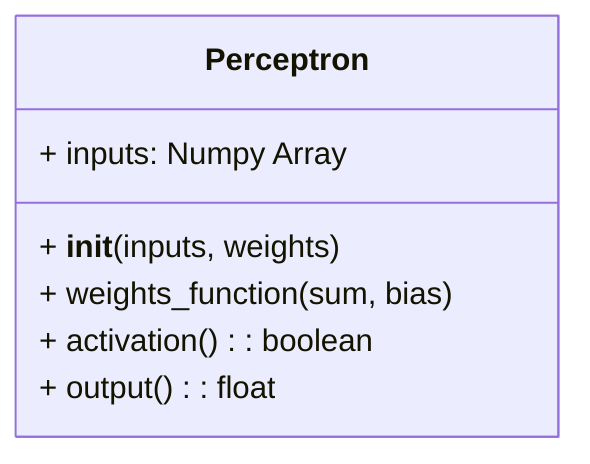

```mermaid
classDiagram
    class Perceptron {
        + inputs: Numpy Array
        + __init__(inputs, weights)
        + weights_function(sum, bias) 
        + activation(): boolean 
        + output(): float
    }
```