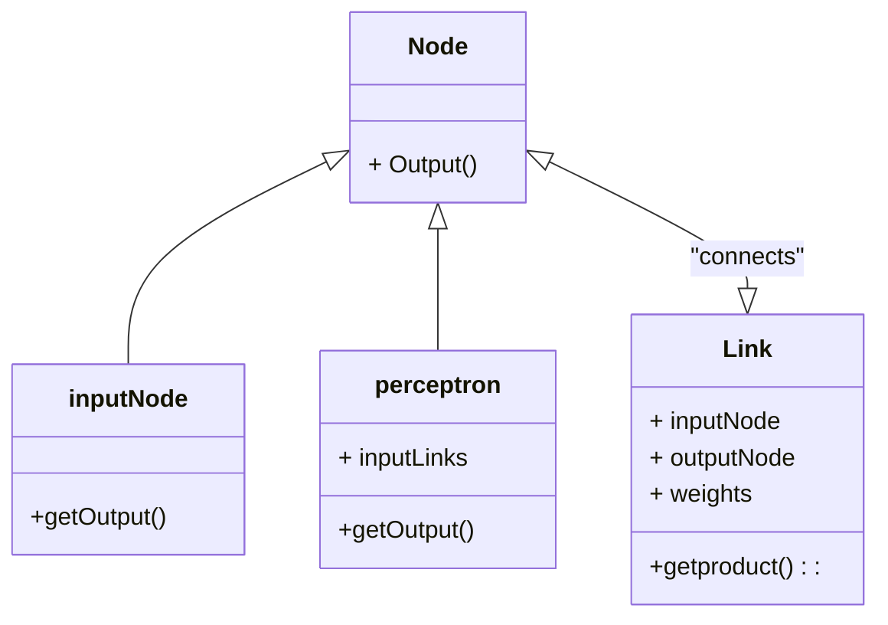

```mermaid
classDiagram
    Node <|-- inputNode
    Node <|-- perceptron
    Node <|--|> Link: "connects"
    
    class Node {
           + Output()
        }

    class inputNode {
        +getOutput()
        }


    class perceptron {
        + inputLinks
        +getOutput()
        }

    class Link{
        + inputNode
        + outputNode
        + weights
        +getproduct(): 
        }
```